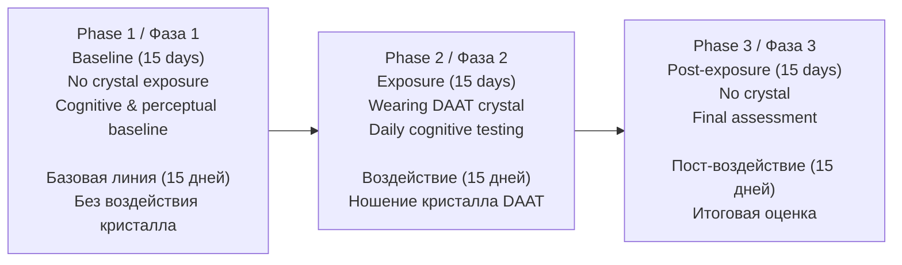
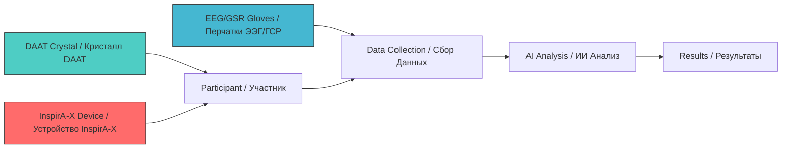
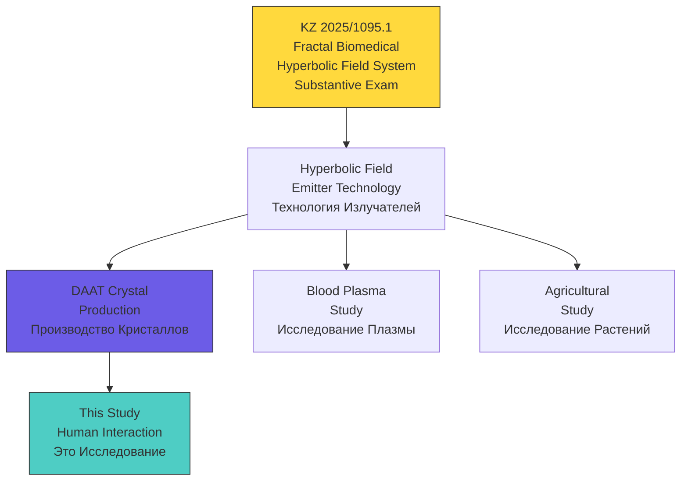
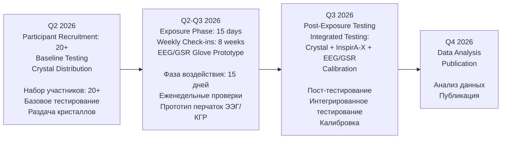

# Hyperbolic Field DAAT Crystal Study / Исследование Кристаллов DAAT Гиперболических Полей

<div align="center">

**Human-Crystal Interaction: Cognitive, Perceptual, and Physiological Effects**

**Взаимодействие Человек-Кристалл: Когнитивные, Перцептивные и Физиологические Эффекты**

[](https://github.com/AdvancedScientificResearchProjects)
[]()
[]()

**Part of Advanced Scientific Research Projects (ASRP) Ecosystem**

**Часть Экосистемы ASRP**

</div>

---

## QUICK NAVIGATION / БЫСТРАЯ НАВИГАЦИЯ

| Section / Раздел | Description / Описание | Status / Статус |
|------------------|----------------------|-----------------|
| [Overview / Обзор](#overview--обзор) | Study objectives / Цели исследования | Defined / Определено |
| [Study Design / Дизайн](#study-design--дизайн-исследования) | Phases, groups, timeline / Фазы, группы, сроки | Protocol v1.3 |
| [Hypotheses / Гипотезы](#hypotheses--гипотезы) | Research questions / Исследовательские вопросы | Defined / Определены |
| [Procedures / Процедуры](#procedures--процедуры) | Test methods / Методы тестирования | Defined / Определены |
| [Team / Команда](#research-team--команда) | Researchers / Исследователи | Assigned / Назначены |
| [Active Issues / Задачи](#active-issues--tasks--активные-задачи) | GitHub Issues / Задачи GitHub | 11 Open |
| [Patent Connection / Патент](#patent-connection--связь-с-патентом) | KZ 2025/1095.1 | Substantive Exam |
| [ASRP Ecosystem / Экосистема](#asrp-ecosystem--экосистема-asrp) | Related repos / Связанные репозитории | Linked |

---

## OVERVIEW / ОБЗОР

### EN

Research study investigating human interaction with DAAT crystals produced using hyperbolic field technologies. The study evaluates effects on cognition, perception, autonomic physiology, and creative processes through structured experimental protocols.

**Central Hypothesis:** Integrated interaction of DAAT Crystal with the cardiac neuroendocrine center may stimulate neurogenesis, neuroplasticity, cognitive flexibility, perception modulation, and creative cognition.

**Long-term Research Question:** Can integrated human-technology training enhance biological intelligence in the AI era?

### RU

Исследование взаимодействия человека с кристаллами DAAT, произведёнными с использованием технологий гиперболических полей. Исследование оценивает воздействие на когнитивные функции, восприятие, автономную физиологию и творческие процессы через структурированные экспериментальные протоколы.

**Центральная Гипотеза:** Интегрированное взаимодействие кристалла DAAT с сердечным нейроэндокринным центром может стимулировать нейрогенез, нейропластичность, когнитивную гибкость, модуляцию восприятия и творческое познание.

**Долгосрочный Исследовательский Вопрос:** Может ли интегрированное обучение человек-технология усилить биологический интеллект в эпоху ИИ?

**Expected Results / Ожидаемые результаты:**
- Reduction of mental noise / Уменьшение ментального шума
- Increased working memory capacity / Увеличение оперативной памяти
- Improved concentration / Увеличение концентрации
- Higher cognitive load tolerance / Способность выдерживать большую когнитивную нагрузку
- Increased productivity / Повышение продуктивности

---

## KEY METRICS / КЛЮЧЕВЫЕ МЕТРИКИ

| Parameter / Параметр | Value / Значение |
|---------------------|-----------------|
| **Study Type / Тип исследования** | Preclinical / Observational / Доклиническое / Наблюдательное |
| **Protocol Version / Версия протокола** | v1.3 (March 2026) |
| **Duration / Длительность** | 45 days / 45 дней (3 phases / 3 фазы) |
| **Participants / Участники** | 20+ (recruitment in progress / набор идёт) |
| **Max Daily Testing / Макс. тестирование в день** | 1.5 hours / 1.5 часа |
| **Patent / Патент** | KZ 2025/1095.1 (Fractal Biomedical Hyperbolic Field System) |
| **Status / Статус** | Participant Recruitment / Набор участников |

---

## HYPOTHESES / ГИПОТЕЗЫ

| # | Hypothesis / Гипотеза | Measurement / Измерение |
|---|----------------------|------------------------|
| H1 | DAAT crystal interaction influences subjective spatial perception / Взаимодействие с кристаллом DAAT влияет на субъективное пространственное восприятие | Subjective decimeter test (10cm line estimation) / Тест субъективного дециметра |
| H2 | Crystal exposure modulates creative cognition patterns / Воздействие кристалла модулирует паттерны творческого познания | AI-based image analysis of free drawings / ИИ-анализ свободных рисунков |
| H3 | Integrated Crystal + InspirA-X exposure produces synergistic cognitive effects / Интегрированное воздействие Кристалл + InspirA-X даёт синергетические когнитивные эффекты | EEG, GSR, cognitive test battery / ЭЭГ, ГСР, когнитивная батарея тестов |
| H4 | Heart rate variability correlates with crystal proximity / Вариабельность сердечного ритма коррелирует с близостью кристалла | HRV monitoring / Мониторинг ВСР |

---

## STUDY DESIGN / ДИЗАЙН ИССЛЕДОВАНИЯ



### Test Groups / Тестовые Группы

| Group / Группа | Protocol / Протокол | Duration / Длительность | Data / Данные |
|---------------|--------------------|-----------------------|---------------|
| **Group 1: Creativity Observation / Наблюдение Творчества** | Free drawing 15 min/day / Свободное рисование 15 мин/день | 45 days / 45 дней | ~60 drawings per participant / ~60 рисунков на участника |
| **Group 2: Spatial Perception / Пространственное Восприятие** | 10cm line estimation test / Тест оценки линии 10см | 45 days / 45 дней | ~5 min/session, daily / ~5 мин/сеанс, ежедневно |

---

## PROCEDURES / ПРОЦЕДУРЫ

| Procedure / Процедура | Description / Описание | Equipment / Оборудование |
|----------------------|----------------------|-------------------------|
| **Subjective Second / Субъективная секунда** | Temporal perception assessment / Оценка восприятия времени | Timer / Таймер |
| **Subjective Decimeter / Субъективный дециметр** | Spatial perception assessment / Оценка восприятия пространства | Ruler, paper / Линейка, бумага |
| **Free Drawing / Свободное рисование** | Creative cognition observation / Наблюдение творческого познания | Paper, pencils / Бумага, карандаши |
| **EEG Monitoring / Мониторинг ЭЭГ** | Brain wave pattern analysis / Анализ паттернов мозговых волн | EEG/GSR Gloves (in development) / Перчатки ЭЭГ/ГСР (в разработке) |
| **GSR Measurement / Измерение ГСР** | Galvanic skin response / Гальваническая кожная реакция | GSR sensors, Ag/AgCl electrodes / Датчики ГСР |

### Subjective Minute Test / Тест Субъективной Минуты

**EN:** A simple method for assessing anxiety and psychoemotional stress level. Time 1 minute on a stopwatch, close eyes, press stop when you feel 1 minute has passed. Results: >60 sec = calm, <60 sec = anxiety (the less, the higher the stress).

**RU:** Простой метод оценки уровня тревожности и психоэмоционального напряжения. Засеките минуту на секундомере, закройте глаза, нажмите стоп когда почувствуете что минута прошла. Результат: >60 сек -- спокойствие, <60 сек -- тревожность (чем меньше, тем выше стресс).

| Result / Результат | Interpretation / Интерпретация |
|-------------------|-------------------------------|
| 65-70 sec | Calm, high self-control / Спокойствие, высокий самоконтроль |
| 55-64 sec | Mild anxiety or fatigue / Лёгкая тревожность или усталость |
| 45-54 sec | Elevated anxiety, nervousness / Повышенная тревожность, нервозность |
| <45 sec | Severe anxiety, extreme stress / Выраженная тревожность, экстремальный стресс |

Protocol photos: [Page 1](docs/protocols/subjective_minute_test_1.jpg) | [Page 2](docs/protocols/subjective_minute_test_2.jpg)

### Integrated Testing / Интегрированное Тестирование



### Experimental Flow / Экспериментальный Поток

**EN:** The participant undergoes cognitive tests (subjective second, subjective decimeter, free drawing, etc.) at baseline. Then the participant wears a DAAT crystal processed by the InspirA-X device combined with an EEG neurointerface. After a wearing period, the participant repeats the cognitive tests. The comparison of pre/post results measures the crystal's effect.

**RU:** Участник проходит когнитивные тесты (субъективная секунда, субъективный дециметр, рисование и др.) на базовом уровне. Затем участник надевает кристалл DAAT, обработанный устройством InspirA-X, в сочетании с нейроинтерфейсом ЭЭГ. После периода ношения участник повторно проходит когнитивные тесты. Сравнение результатов до/после измеряет эффект кристалла.

---

## DATA STRUCTURE / СТРУКТУРА ДАННЫХ

```
Hyperbolic_Field_DAAT_Crystal_Study/
|
|-- README.md
|
|-- data/
|   |-- baseline/                      # Phase 1 data (15 days) / Данные фазы 1
|   |-- exposure/                      # Phase 2 data (15 days) / Данные фазы 2
|   |-- post-exposure/                 # Phase 3 data (15 days) / Данные фазы 3
|   `-- crystals/                      # Crystal specimens / Образцы кристаллов
|       |-- photos/                    # Photos with serial numbers / Фото с серийными номерами
|       |   |-- ASRP-CRYSTAL-DAAT-SPF-HF-202602_000111-VORTEX.jpg
|       |   |-- ASRP-CRYSTAL-DAAT-SPF-HF-202602_001111-MOSEDEUS.jpg
|       |   |-- ASRP-CRYSTAL-DAAT-SPF-HF-202602_011110-MOZO.jpg
|       |   |-- ASRP-CRYSTAL-DAAT-SPF-HF-202602_111100-ZEURTEX.jpg
|       |   `-- (+ alt angles, general photos)
|       `-- video/
|           `-- DAAT_crystals_overview.mp4
|
|-- docs/
|   `-- protocols/                     # Protocol references / Протоколы
|       |-- subjective_minute_test_1.jpg
|       `-- subjective_minute_test_2.jpg
|
|-- drawings/                          # Participant free drawings / Рисунки участников
|-- charts/                            # Analysis charts / Графики
|-- reports/                           # Analysis reports / Отчёты
|-- protocols/                         # Experiment protocols / Протоколы экспериментов
`-- scripts/                           # Analysis scripts / Скрипты
```

> **Note / Примечание:** Folders marked (TBD) will be created as the study progresses. Crystal photos with serial numbers need to be requested from the team / Папки с пометкой (TBD) будут созданы по мере продвижения исследования. Фото кристаллов с серийными номерами нужно запросить у команды.

---

## CRYSTAL SPECIMENS / КАТАЛОГ КРИСТАЛЛОВ

All specimens share catalog prefix: `ASRP-CRYSTAL-DAAT-SPF-HF-202602`

| Catalog ID / Каталожный номер | Name / Название | Photo / Фото |
|------------------------------|-----------------|--------------|
| 000111 | VORTEX | [View](data/crystals/photos/ASRP-CRYSTAL-DAAT-SPF-HF-202602_000111-VORTEX.jpg) |
| 001111 | MOSEDEUS | [View](data/crystals/photos/ASRP-CRYSTAL-DAAT-SPF-HF-202602_001111-MOSEDEUS.jpg) |
| 011110 | MOZO | [View](data/crystals/photos/ASRP-CRYSTAL-DAAT-SPF-HF-202602_011110-MOZO.jpg) |
| 111100 | ZEURTEX | [View](data/crystals/photos/ASRP-CRYSTAL-DAAT-SPF-HF-202602_111100-ZEURTEX.jpg) |

[All specimens composite / Все образцы](data/crystals/photos/ASRP-CRYSTAL-DAAT-SPF-HF-202602_all_specimens.jpg)

---

## PATENT CONNECTION / СВЯЗЬ С ПАТЕНТОМ



| Patent / Патент | Application / Заявка | Status / Статус | Link / Ссылка |
|----------------|---------------------|-----------------|---------------|
| **Fractal Biomedical System** | KZ 2025/1095.1 | Substantive Exam / Экспертиза по существу | [View / Просмотр](https://github.com/denisbanchenko/Kazpatent_Fractal_Biomedical_System_Patent) |

### InspirA-X Connection / Связь с InspirA-X

| Resource / Ресурс | Link / Ссылка |
|-------------------|---------------|
| **InspirA-X Patent / Патент InspirA-X** | [KZ 2025/0914.1](https://github.com/denisbanchenko/Kazpatent_Inspira-X_Respiratory_Analysis_Patent) |
| **Scientific Publication / Научная публикация** | Publication pending / Публикация ожидается |

---

## OSF PREREGISTRATION / ПРЕДВАРИТЕЛЬНАЯ РЕГИСТРАЦИЯ OSF

| Field / Поле | Value / Значение |
|--------------|------------------|
| **Status / Статус** | [osf.io/m9h6g/](https://osf.io/m9h6g/) -- Registered / Зарегистрировано |
| **Platform / Платформа** | [OSF.io](https://osf.io) |

---

## RESEARCH TEAM / КОМАНДА

| Name / ФИО | Role / Роль | Responsibilities / Обязанности |
|-----------|------------|-------------------------------|
| **Valeria Ovsyannikova / Валерия Овсянникова** | Director of Biomedical Research Department / Директор департамента биомедицинских исследований | Research coordination, protocol design, EEG/GSR glove design & integration / Координация исследований, дизайн протокола, проектирование и интеграция перчаток ЭЭГ/ГСР |
| **Ivan Savelyev / Иван Савельев** | Science Director & Editor-in-Chief of ASRP.science / Директор по науке и главный редактор научного журнала ASRP.science | Scientific research direction / Научное направление |
| **Mykhailo Kapustin / Михайло Капустин** | CTO & Director of AI and IT Department / Технический директор и директор департамента ИИ и ИТ | Digital platform, data infrastructure / Цифровая платформа, инфраструктура данных |
| **Kyryl Zmiienko / Кирилл Змиенко** | Chief AI Engineer / Главный ИИ-инженер | AI models, neural network analysis / ИИ-модели, анализ нейросетей |
| **Alexandr Ovsyannikov / Александр Овсянников** | Head Hardware Engineer / Главный Инженер по Аппаратному Обеспечению | EEG/GSR glove electronics & fabrication / Электроника и изготовление перчаток ЭЭГ/ГСР |
| **Denis Banchenko / Денис Банченко** | Program Director, Author of Research Methodology & Technology / Директор программы, автор методологии и технологии исследования | Project management, hyperbolic field physics / Управление проектом, физика гиперболических полей |

### International Collaboration / Международное Сотрудничество

| Partner / Партнёр | Country / Страна | Details / Детали |
|-------------------|-----------------|------------------|
| Cyprus Research Institute | Cyprus / Кипр | Details pending / Детали ожидаются |

---

## ACTIVE ISSUES & TASKS / АКТИВНЫЕ ЗАДАЧИ

| # | Title / Название | Priority / Приоритет | Due / Срок | Status / Статус |
|---|-----------------|---------------------|-----------|-----------------|
| [#1](https://github.com/AdvancedScientificResearchProjects/Hyperbolic_Field_DAAT_Crystal_Study/issues/1) | DAAT Crystal Human Study Protocol / Протокол исследования | — | — | Protocol v1.3 |
| [#2](https://github.com/AdvancedScientificResearchProjects/Hyperbolic_Field_DAAT_Crystal_Study/issues/2) | DAAT Crystal Protocol / Протокол | — | — | Recruitment / Набор |
| [#3](https://github.com/AdvancedScientificResearchProjects/Hyperbolic_Field_DAAT_Crystal_Study/issues/3) | Participant Recruitment (20+) / Набор участников | High | Q2 2026 | Open |
| [#4](https://github.com/AdvancedScientificResearchProjects/Hyperbolic_Field_DAAT_Crystal_Study/issues/4) | Baseline Cognitive Testing / Базовое тестирование | High | Q2 2026 | Open |
| [#5](https://github.com/AdvancedScientificResearchProjects/Hyperbolic_Field_DAAT_Crystal_Study/issues/5) | Crystal Distribution / Распределение кристаллов | High | Q2 2026 | Open |
| [#6](https://github.com/AdvancedScientificResearchProjects/Hyperbolic_Field_DAAT_Crystal_Study/issues/6) | Weekly Check-ins (8 weeks) / Еженедельные проверки | Medium | Q2-Q3 2026 | Open |
| [#7](https://github.com/AdvancedScientificResearchProjects/Hyperbolic_Field_DAAT_Crystal_Study/issues/7) | Post-Exposure Testing / Пост-тестирование | High | Q3 2026 | Open |
| [#8](https://github.com/AdvancedScientificResearchProjects/Hyperbolic_Field_DAAT_Crystal_Study/issues/8) | Data Analysis & Publication / Анализ и публикация | — | — | Open |
| [#9](https://github.com/AdvancedScientificResearchProjects/Hyperbolic_Field_DAAT_Crystal_Study/issues/9) | Crystal + InspirA-X + EEG/GSR Integrated Testing | High | Q3 2026 | Open |
| [#10](https://github.com/AdvancedScientificResearchProjects/Hyperbolic_Field_DAAT_Crystal_Study/issues/10) | Fabricate EEG/GSR Measurement Gloves — Lead: Valeria Ovsyannikova, Electronics: Alexandr Ovsyannikov | High | Q3 2026 | Open |
| [#11](https://github.com/AdvancedScientificResearchProjects/Hyperbolic_Field_DAAT_Crystal_Study/issues/11) | Patent Application KZ 2025/1095.1 | — | — | Exam |

---

## TIMELINE / ВРЕМЕННАЯ ШКАЛА



---

## ASRP ECOSYSTEM / ЭКОСИСТЕМА ASRP

<div align="center">

### Related Research Repositories / Связанные Исследовательские Репозитории

</div>

| Repository / Репозиторий | Direction / Направление | Link / Ссылка |
|-------------------------|------------------------|---------------|
| **Hyperbolic Field Blood Plasma Study** | Blood plasma coagulation / Свёртываемость плазмы | [View / Просмотр](https://github.com/AdvancedScientificResearchProjects/Hyperbolic_Field_BloodPlasma_Study) |
| **Hyperbolic Field Agricultural Study** | Plant & seed growth / Рост растений и семян | [View / Просмотр](https://github.com/AdvancedScientificResearchProjects/Hyperbolic_Field_Agricultural_Study) |
| **Hyperbolic Field Saccharomyces Study** | Yeast fermentation / Ферментация дрожжей | [View / Просмотр](https://github.com/AdvancedScientificResearchProjects/Hyperbolic_Field_SaccharomycesCerevisiae_Study) |
| **ASRP.art** | Art & consciousness / Искусство и сознание | [View / Просмотр](https://github.com/AdvancedScientificResearchProjects/Axionetic_Sensing_Reactions_Platform_in_Art) |
| **UAP Reverse Engineering** | UAP analysis / Анализ НЛО | [View / Просмотр](https://github.com/AdvancedScientificResearchProjects/UAP_Reverse_Engineering_Study) |
| **PLFM RADAR** | Phased array radar / Фазированная антенная решётка | [View / Просмотр](https://github.com/AdvancedScientificResearchProjects/PLFM_RADAR) |

<div align="center">

### Patent Portfolio / Патентный Портфель

</div>

| Patent / Патент | Application / Заявка | Link / Ссылка |
|----------------|---------------------|---------------|
| **Fractal Biomedical System** | KZ 2025/1095.1 | [View / Просмотр](https://github.com/denisbanchenko/Kazpatent_Fractal_Biomedical_System_Patent) |
| **ASRP.art** | KZ 2025/0592.1 + PCT | [View / Просмотр](https://github.com/denisbanchenko/Kazpatent_Axionetic_Sensing_Reactions_Platform_in_Art_Patent) |
| **ASRP.drift** | KZ 413554 | [View / Просмотр](https://github.com/denisbanchenko/Kazpatent_Advanced_Synchro_Resonance_Platform_For_Deep_Resonant_Patent) |
| **GFS** | KZ 2025/1096.1 | [View / Просмотр](https://github.com/denisbanchenko/Kazpatent_Global_Forecasting_System_Patent) |
| **Inspira-X** | KZ 2025/0914.1 | [View / Просмотр](https://github.com/denisbanchenko/Kazpatent_Inspira-X_Respiratory_Analysis_Patent) |
| **Biophotonic** | KZ 2025/1097.1 | [View / Просмотр](https://github.com/denisbanchenko/Kazpatent_Biophotonic_Neurodiagnostic_System_Patent) |

---

## CONTACT INFORMATION / КОНТАКТНАЯ ИНФОРМАЦИЯ

| Field / Поле | Value / Значение |
|--------------|------------------|
| **Organization / Организация** | ТОО "Перспективные Научно-Исследовательские Разработки" / Advanced Scientific Research Projects LLP |
| **Address / Адрес** | Komarova St. 37, Apt 56, Baikonur, 468320 / Ул. Комарова 37, кв. 56, г. Байконур, 468320 |
| **Country / Страна** | Republic of Kazakhstan / Республика Казахстан |
| **Website / Веб-сайт** | [asrp.tech](https://asrp.tech) |
| **Email** | info@asrp.tech |

---

<div align="center">

**Last Updated / Последнее обновление:** April 2026

**Status / Статус:** Participant Recruitment / Набор Участников

</div>

---

## TBD

- Cyprus institute collaboration details / Детали сотрудничества с институтом на Кипре
- EEG/myography baseline protocols / Базовые протоколы ЭЭГ/миографии

---

## NAVIGATION INDEX / НАВИГАЦИОННЫЙ ИНДЕКС

[Overview / Обзор](#overview--обзор) · [Key Metrics / Метрики](#key-metrics--ключевые-метрики) · [Hypotheses / Гипотезы](#hypotheses--гипотезы) · [Study Design / Дизайн](#study-design--дизайн-исследования) · [Procedures / Процедуры](#procedures--процедуры) · [Data Structure / Структура](#data-structure--структура-данных) · [Patent Connection / Патент](#patent-connection--связь-с-патентом) · [Team / Команда](#research-team--команда) · [Active Issues / Задачи](#active-issues--tasks--активные-задачи) · [Timeline / Сроки](#timeline--временная-шкала) · [ASRP Ecosystem / Экосистема](#asrp-ecosystem--экосистема-asrp) · [Contact / Контакты](#contact-information--контактная-информация)
